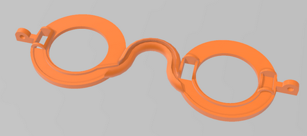
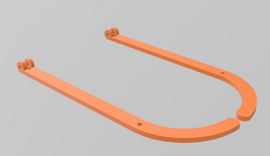

# Ulleres-de-colors
Es tracta construir unes ulleres amb impressió 3D, que munten LEDs Neopixels i es poden generar centenars de combinacions de llum.  

Realitzat per [Jordi Mayné](https://github.com/maynej) des de Mechatronic Study jordi.mayne@mechatronicstudy.com 

La documentació està disponible també en castellà [en PDF](https://github.com/maynej/Ulleres-de-colors/tree/main/Doc/). 

# Arxius per imprimir 
  
Descripció         | Imatge          | Arxiu STL    
------------- | ------------- | ------------- 
Ulleres | | [Ulleres](STL/Ulleres.stl)
Varetes | | [Varetes](STL/Varetes.stl)

Creative Commons Attribution-NoComercial-ShareAlike 4.0 International (CC BY-NC-SA 4.0)  

## QR

